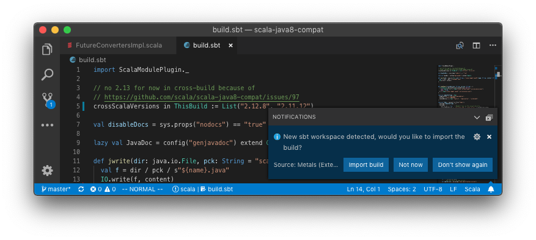

sbt is most commonly used build tool in the Scala community works with Metals
out-of-the-box.

## Automatic installation

The first time you open Metals in a new workspace it prompts you to import the
build. Select "Import build" to start automatic installation.



## Install without Bloop

Automatic build import for sbt happens through
[Bloop](https://scalacenter.github.io/bloop/), a compile server for Scala. Bloop
implements the
[Build Server Protocol (BSP)](https://github.com/scalacenter/bsp/blob/master/docs/bsp.md)
that Metals uses to learn the directory structure of your project and its
library dependencies. sbt does not implement BSP so Metals is not able to import
sbt builds without Bloop.

## Manual installation

> It's recommended to use automatic installation over manual installation since
> manual installation requires several independent steps that makes it harder to
> stay up-to-date with the latest Metals version.

Instead of using automatic build import, you can manually install sbt-metals and
generate the Bloop JSON files directly from your sbt shell. This approach may
speed up build import by avoiding Metals from starting sbt in a separate
process.

First, install the Bloop and Metals plugins globally

```scala
// One of:
//   ~/.sbt/0.13/plugins/plugins.sbt
//   ~/.sbt/1.0/plugins/plugins.sbt
resolvers += Resolver.sonatypeRepo("snapshots")
addSbtPlugin("org.scalameta" % "sbt-metals" % "@VERSION@")
addSbtPlugin("ch.epfl.scala" % "sbt-bloop" % "@BLOOP_VERSION@")
```

Next, run `sbt metalsEnable bloopInstall` to generate the Bloop JSON
configuration files.

Finally, once `bloopInstall` is finished, execute the "Import build" command
(id: `build.import`) command to tell Metals to establish a connections with the
Bloop build server.

For more information about sbt-bloop, consult the
[Bloop website](https://scalacenter.github.io/bloop/docs/installation/#sbt).

### Permanent metalsEnable

If you use manual installation, you can avoid running the `metalsEnable` command
in every sbt session with the following steps.

First, update the global Bloop settings to download sources of external
libraries.

```scala
// One of:
//   ~/.sbt/0.13/build.sbt
//   ~/.sbt/1.0/build.sbt
bloopExportJarClassifiers.in(Global) := Some(Set("sources"))
```

Next, update your build settings to use the
[semanticdb-scalac](https://scalameta.org/docs/semanticdb/guide.html) compiler
plugin.

```diff
// build.sbt
 lazy val myproject = project.settings(
+  scalaVersion := "@SCALA_VERSION@", // or @SCALA211_VERSION@, other versions are not supported.
+  addCompilerPlugin(MetalsPlugin.semanticdbModule), // enable SemanticDB
+  scalacOptions += "-Yrangepos" // required by SemanticDB
 )
```

Now, you can run `sbt bloopInstall` without the `metalsEnable` step.

**Pro tip**: With semanticdb-scalac enabled in your sbt build can also use
[Scalafix](https://scalacenter.github.io/scalafix).

```scala mdoc:custom-bloop

```

## Troubleshooting

Before reporting an issue, check if your problem is solved with one of the
following tips.

### Waiting for lock on .ivy2/.sbt.ivy.lock

Metals run sbt in a separate process and this error happens where there are two
sbt processes resolving dependencies at the same time.

### Not valid key: metalsEnable

This error might indicate that you have an old version of `sbt-metals` installed
in your project.

```
[error] Not a valid key: metalsEnable (similar: scalafixEnabled)
[error] metalsEnable
[error]             ^
```

Try to remove any usage of `sbt-metals` in your build.

### Module not found: org.scalameta#semanticdb-scalac_2.12.4

Metals works only with Scala 2.12.7 and 2.11.12 at the moment, down to the exact
version. If you are using an older version of Scala then the SemanticDB compiler
plugin will not resolve.
