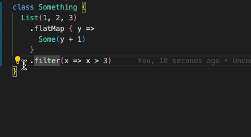

Code Actions are used to provide automatic refactoring or rewriting of your current code in order to enhance its readability or save users' time.

In Visual Studio Code, to use them you can click on the yellow light bulb appearing on your code, near the cursor and then, to pick the desired action to perform on the code. Alternatively, you can use the `editor.action.quickFix` shortcut.

For other editors this should also be available via specified shortcut.

Here is a list of the code actions supported by Metals.

## Convert To Named Arguments

This code action adds the name to parameters passed to a method call or a class constructor.

## Create Companion Object

If you have a `trait` or a `class` definition, you can invoke this code action to create its companion object.

## Create New Symbol

Used for creating a definition for a symbol which is used in your code, but not defined anywhere.

## Extract Member

Extract a class, trait, or object definition to a new file.

## Rename File

Renames a file to match that of the prominent type defined in it.

## Extract Value

If you think your code would look nicer, if the calculation of a value is extracted and assigned to a new `val`; this code action would come to your aid.

## map, flatMap, withFilter to For Yield

It converts a chain of `map`, `flatMap`, `filter` and `filterNot` methods into a for comprehension.

## Implement Abstract Members of the Parent Type

Upon inheriting from a type, you also have to implement its abstract members. But manually looking them all up and copying their signature is time consuming, isn't it? You can just use this code action instead.

## Import Missing Symbol 

Because, of course, you often do not remember the package where it is located, without using this code action. right?

## Insert Inferred Type

This code action infers the type of variables according to the context, and insert them for you.

## Organize Imports

Provided that you have enabled the warn unused option for imports of the scala compiler; this code action can tidy up your imports and remove the unused ones. Please note that, in some editors, it is not available under the light bulb, so you would need to access it in other ways.

## Pattern Match On `_` To Partial Function

When a pattern match is done on a `_` symbol, a partial function on the input would not only be semantically equivalent to it, but also would look cleaner.

## String to Multiline and Interpolation

This one saves you from having to manually type the `s` symbol in the beginning of a string, for creating an interpolation; or the extra quotes at the start and end for turning it into a multiline one.

