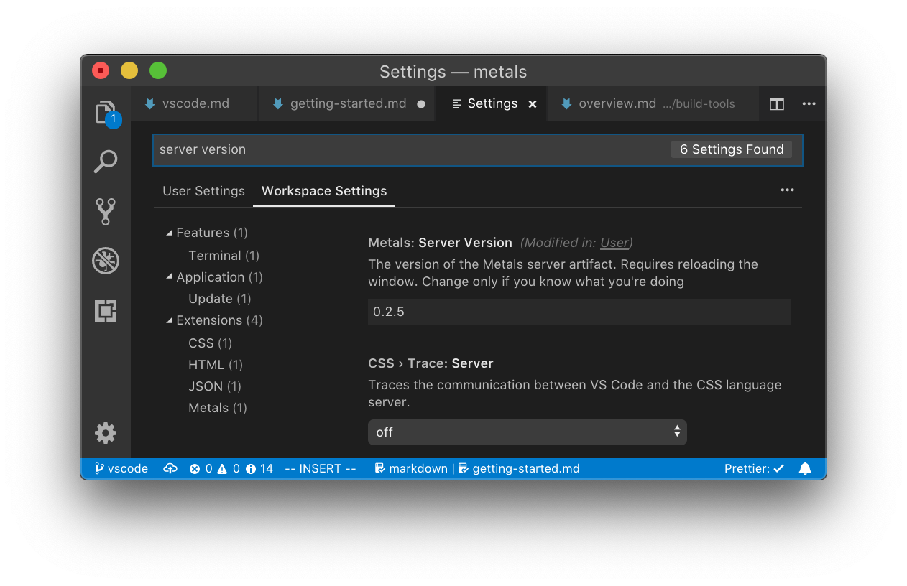

Whenever you are stuck or unsure, please open an issue or
[ask on Gitter](https://gitter.im/scalameta/metals). This project follows
[Scalameta's contribution guidelines](https://github.com/scalameta/scalameta/blob/master/CONTRIBUTING.md).

## Requirements

You will need the following applications installed:

- Java 8, make sure `JAVA_HOME` points to a Java 8 installation and not Java 11.
- `git`
- `sbt` (for building a local version of the server)

## Project structure

- `metals` the main project with sources of the Metals language server.
- `mtags` source file indexer for Java and Scala, it's a dependency of the
  `metals` project but kept in a separate module so it can be used by other
  projects like [Metabrowse](https://github.com/scalameta/metabrowse).
- `tests/input` example Scala code that is used as testing data for unit tests.
- `tests/unit` moderately fast-running unit tests.
- `tests/slow` slow integration tests.
- `test-workspace` demo project for manually testing Metals through an editor.

## Related projects

The improvement you are looking to contribute may belong in a separate
repository:

- [scalameta/metals-vscode](https://github.com/scalameta/metals-vscode/): the
  Visual Studio Code extension for Metals.
- [scalameta/scalameta](https://github.com/scalameta/scalameta/): SemanticDB,
  parsing, tokenization.
- [scalacenter/bloop](https://github.com/scalacenter/bloop/): build server for
  compilation.
- [scala/scala](https://github.com/scala/scala/): presentation compiler.
- [scalameta/scalafmt](https://github.com/scalameta/scalafmt/): code formatting.
- [scalacenter/scalafix](https://github.com/scalacenter/scalafix/): code
  refactoring and linting.

## Unit tests

To run the unit tests open an sbt shell and run `unit/test`

```sh
sbt
# Run once in the beginning and run again for every change in the sbt plugin.
> sbt-metals/publishLocal
# (recommended) run specific test suite, great for edit/test/debug workflows.
> metals/testOnly -- tests.DefinitionSuite
# run unit tests, modestly fast but still a bit too slow for edit/test/debug workflows.
> unit/test
# run slow integration tests, takes several minutes.
> slow/test
# (not recommended) run all tests, slow. It's better to target individual projects.
> test
```

## Manual tests

Some functionality is best to manually test through an editor. A common workflow
while iterating on a new feature is to run `publishLocal` and then open an
editor in a small demo build.

### Visual Studio Code

Install the Metals extension from the Marketplace, search for "Metals".

[Click here to install the Metals VS Code plugin](vscode:extension/scalameta.metals)

Next, update the "Server version" setting under preferences to point to the
version you published locally via `sbt publishLocal`.



When you make changes in the Metals Scala codebase

- run `sbt publishLocal`
- execute the "Metals: Restart server" command in Visual Studio Code (via
  command palette)

### Vim

First, follow the [`vim` installation instruction](../editors/vim.html).

Next, write a `new-metals-vim` script that builds a new `metals-vim` bootstrap
script using the locally published version.

```sh
coursier bootstrap \
  --java-opt -Dmetals.client=vim-lsc \
  org.scalameta:metals_2.12:@LOCAL_VERSION@ \ # double-check version here
  -r bintray:scalacenter/releases \
  -o /usr/local/bin/metals-vim -f
```

Finally, start vim with the local Metals version

```sh
cd test-workspace # any directory you want to manually test Metals
new-metals-vim && vim build.sbt
```

When you make changes in the Metals Scala codebase, run `sbt publishLocal`, quit
vim and re-run `new-metals-vim && vim build.sbt`.

### Workspace logs

Metals logs workspace-specific information to the
`$WORKSPACE/.metals/metals.log` file.

```sh
tail -f .metals/metals.log
```

These logs contain information that may be relevant for regular users.

### JSON-RPC trace

To see trace of incoming/outgoing JSON communication with the text editor or
build server, create empty files in your machine cache directory.

```sh
# macOS
touch -f ~/Library/Caches/org.scalameta.metals/lsp.trace.json # text editor
touch -f ~/Library/Caches/org.scalameta.metals/bsp.trace.json # build server
# Linux
touch ~/.cache/metals/lsp.trace.json # text editor
touch ~/.cache/metals/bsp.trace.json # build server
```

Next when you start Metals, watch the logs with `tail -f`.

```sh
# macOS
tail -f ~/Library/Caches/org.scalameta.metals/lsp.trace.json
# Linux
tail -f ~/.cache/metals/lsp.trace.json
```

The traces are very verbose so it is recommended to delete the files if you are
not interested in debugging the JSON communication.
