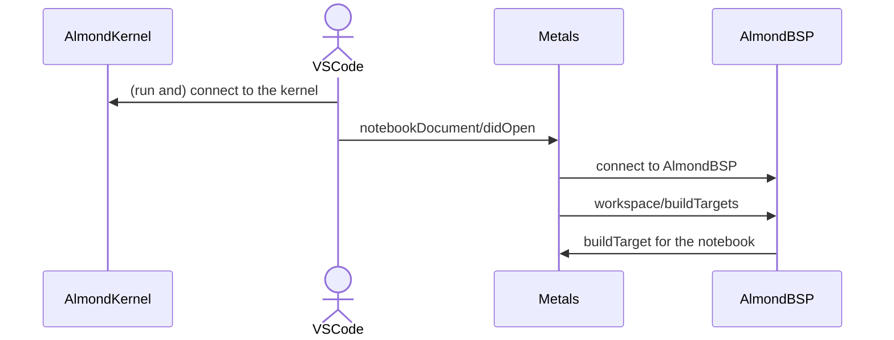
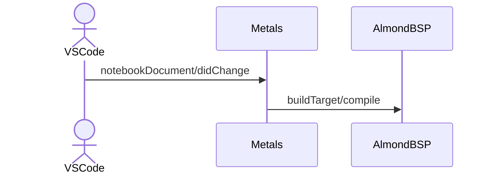

Language support for VSCode notebook

# Overview

We can run Scala programs on Jupyter Notebooks using a Jupyter Kernel for Scala called [Almond](https://almond.sh/).

Currently, when using notebook cells in VSCode, Metals cannot provide language support such as code completion (by Metals) and code navigations.

This design document describes how Metals can support many language features for the notebook environment in VSCode

# Scope

The scope of this document is limited to **notebook in VSCode**. It doesn't cover LSP support for jupyter notebook in general (like integration with [jupyter-lsp](https://github.com/jupyter-lsp/jupyterlab-lsp)).

However, supporting the notebooks in VSCode would be a good first step for integrations with other notebook environments.

## Goal

- When users running Almond Kernel in VSCode, users can enjoy language features that Metals provides.
  - All the `textDocument/*` requests should be properly handled.
  - (Maybe we can omit some features for notebook (like `textDocument/foldingRange` may be useless in notebook) though).

## Non-Goal

- Provide language support for other notebook environments other than VSCode notebook (such as `jupyter-lsp`).
- Automatically set up Almond Kernel based on the project setting
  - Install Almond Kernel when users open a `*.ipynb` file and no Scala Kernel is available.
- Enable Almond to use project-defined components from notebooks.
  - If we have `A.scala` adjacent to `B.ipynb`, `B.ipynb` should be able to `import` something from `A.scala`.

# Context

## LSP 3.17 NotebookCellTextDocumentFilter

Starting from LSP 3.17, LSP clients can recognize notebook cells as documents and request `textDocument/*` to LSP servers.
For example, the following change unlocks the `textDocument/*` requests for jupyter-notebook (of Scala cells) in VSCode.

```diff
diff --git a/src/extension.ts b/src/extension.ts
index 13b49f6f..32a99c36 100644
--- a/src/extension.ts
+++ b/src/extension.ts
@@ -291,6 +291,10 @@ function launchMetals(
       { scheme: "file", language: "java" },
       { scheme: "jar", language: "scala" },
       { scheme: "jar", language: "java" },
+      {
+        notebook: { scheme: "file", notebookType: "jupyter-notebook" },
+        language: "scala",
+      },
     ],
     synchronize: {
       configurationSection: "metals",
```

see: https://microsoft.github.io/language-server-protocol/specifications/lsp/3.17/specification/#notebookCellTextDocumentFilter

Now, notebook on VSCode starts sending the `textDocument/*` request to LSP server.

```json
[Trace - 01:09:28 PM] Received request 'textDocument/completion - (140)'
Params: {
  "context": {
    "triggerKind": 2,
    "triggerCharacter": "."
  },
  "textDocument": {
    "uri": "vscode-notebook-cell:/Users/tanishiking/src/github.com/tanishiking/scala3-playground/src/main/scala/Untitled-1.ipynb#W2sZmlsZQ%3D%3D"
  },
  "position": {
    "line": 0,
    "character": 2
  }
}
```

## LSP 3.17 Notebook Document syncronization

In addition to `NotebookCellTextDocumentFilter`, LSP 3.17 provides a feature called Notebook Document syncronization.

see: https://microsoft.github.io/language-server-protocol/specifications/lsp/3.17/specification/#notebookDocument_synchronization

By setting server capabilities in `scalameta/metals`

```diff
diff --git a/metals/src/main/scala/scala/meta/internal/metals/MetalsLanguageServer.scala b/metals/src/main/scala/scala/meta/internal/metals/MetalsLanguageServer.scala
index 00aa1d791f..35b0ea2dc9 100644
--- a/metals/src/main/scala/scala/meta/internal/metals/MetalsLanguageServer.scala
+++ b/metals/src/main/scala/scala/meta/internal/metals/MetalsLanguageServer.scala
@@ -860,6 +860,16 @@ class MetalsLanguageServer(
             ServerCommands.all.map(_.id).asJava
           )
         )
+        val selector = new NotebookSelector()
+        selector.setNotebook(
+          JEither.forLeft[String, NotebookDocumentFilter]("*")
+        )
+        selector.setCells(List(new NotebookSelectorCell("scala")).asJava)
+        capabilities.setNotebookDocumentSync(
+          new NotebookDocumentSyncRegistrationOptions(
+            List(selector).asJava
+          )
+        )
         capabilities.setFoldingRangeProvider(true)
         capabilities.setSelectionRangeProvider(true)
         capabilities.setCodeLensProvider(new CodeLensOptions(false))
```

Notebook LSP client start sending several notifications such as `notebookDocument/didOpen`, and `notebookDocument/didChange`.
LSP 3.17 expects LSP servers to syncronize the notebook contents by these notifications, and provide language features based on the synchronized content.

# Problems

Though LSP 3.17 provides some specifications around notebook support, it doesn't work out of the box with Metals for mainly two reasons.

## Metals doesn't understand the Scala program in a cell

As you found, LSP client (VSCode) sends `textDocument/*` request with

- `uri` points to the notebook cell.
- `position` represents the position in the cell.

```
"textDocument": {
  "uri": "vscode-notebook-cell:/Users/tanishiking/src/github.com/tanishiking/scala3-playground/src/main/scala/Untitled-1.ipynb#W2sZmlsZQ%3D%3D"
},
"position": {
  "line": 0,
  "character": 2
}
```

However, Metals can't understand each cell of notebook. For example, in the following setting, Metals can't handle cell2 and cell3 (in Scala2, Metals can't cell1 too). Because each cell doesn't compile.

```scala
// cell1
def add(a: Int, b: Int): Int = a + b

// cell2
add(1, 2)

// cell3
import $ivy.`io.circe::circe-generic:0.11.1`
```

**In order to analyze Scala code and provide compiler-based language features, Metals have to convert cells into compilable Scala program.**

## Metals server cannot recognise `*.ipynb` file as a compile target

Metals server provide language features to the files that are recognized as a `buildTarget/sources` of [Build Server Protocol](https://build-server-protocol.github.io/docs/specification.html#build-target-sources-request).

However, current Metals doesn't recognize `*.ipynb` (or combined Scala source, that we'll mention later) for Build Servers.

**Metals have to run build server that recognizes `*.ipynb` files as a `SourceItem`**. Otherwise, Metals cannot tell which Scala version of presentation compiler should run against the notebook (Kernel).

# Solution / Technical Architecture

In order to provide language support for notebooks, two things are needed.

- Convert cells to compilable Scala sources.
  - Also, Metals have to convert the incoming request parameter (for cells) into the parameter for the (converted) compilable Scala source (back and forth).
  - Converted sources have to be on the filesystem, because Metals expect sources to be on the filesystem.
- Build Server that recognizes `*.ipynb` as a build target.
  - Where `ScalaBuildTarget.scalaVersion` should match with the Scala version of the running Kernel.
  - When users open a notebook with Scala Kernel, Metals should prompt running the Build Server for the notebook, like Metals does for Ammonite script.

## Components

- `Almond BSP`
  - Run on the same process with `Almond Kernel`, but the I/O will be via unix domain socket at a pre-defined location (somewhere in `~/.local/share/almond/bsp/{kernel-name}.sock`). See: https://github.com/scalameta/metals/pull/4253#issuecomment-1222091839
  - `buildTarget/compile` will convert cells into compilable Scala sources (as Almond Kernel / Ammonite does) and **write the generated Scala sources onto the file system** (as Ammonite Build Server does). Also, `buildTarget/compile` should enable SemanticDB plugin.
  - Answer `workspace/buildTargets`. One notebook - one buildTarget.
    - Scala version should be match with Kernel's one.
  - Accept `buildTarget/scalacOptions` and `ScalacOptions.classDirectory` should point to the directory where Metals can find the Almond-generated Scala sources.
    - (optional) instead, we can support `workspace/wrappedSources` as [ScalaCli does](https://github.com/VirtusLab/scala-cli/blob/6efbefb1d864c0ee36156f9ac8489d0e14ee54c4/modules/scala-cli-bsp/src/main/java/scala/build/bsp/ScalaScriptBuildServer.java#L9-L10)
- `VSCode`
  - Notebook LSP client, send `textDocument/*` requests to `Metals` and receive responses.
  - Notify `notebookDocument/didOpen|didChange` to Metals server.
- `Metals`
  - When Metals receive `notebookDocument/didOpen`, connect to Almond BSP and register the result of `workspace/buildTargets`.
  - Receive `textDocument/*` request and convert the params to the generated Scala source. And then convert the result back to the cell positions.

## System flow

### When VSCode start running Almond Kernel on VSCode



- 1. When Almond Kernel started, Almond Kernel process will create a sock file (for Almond BSP) in a pre-defined position.
- 2. When VSCode open a notebook, Metals will receive `notebookDocument/didOpen`, then Metals will try to connect to the Almond BSP via the sock file created at (1)
  - Concern: Metals may have to wait until the sock file is created (?)
- 3. Then Metals asks `workspace/buildTargets` to Almond BSP, and Almmond BSP answers.
- 4. Register the mapping URI of notebook cell -> generated Scala sources to [MappedSource](https://github.com/scalameta/metals/blob/626b2a65199ea39ffca68f1e6330b67b9142a1fe/metals/src/main/scala/scala/meta/internal/metals/TargetData.scala#L303-L308)
  - see: https://github.com/scalameta/metals/blob/626b2a65199ea39ffca68f1e6330b67b9142a1fe/metals/src/main/scala/scala/meta/internal/metals/ammonite/Ammonite.scala#L108-L129
  - It would be even trickier than Almond one.

### When editing notebook



- 1. Every time users edit notebook, Metals receive `notebookDocument/didChange`.
- 2. Then Metals will run `buildTarget/compile` to Almond BSP for generating the compilable Scala source files and generate SemanticDBs.
  - I guess it would be required because users usually keep coding on Notebook without saving.
  - Maybe we want to debounce the `buildTarget/compile`

## When VSCode request `textDocument/*`

- We can convert notebook cell's URI `<->` generated Scala source for the cell, using `MappedSource`.
- Conversion between position in the cell `<->` position in the generated Scala source can be done as the same way with Almond script.

# Alternative Solution

## Can we just combine cells into Ammonite script, instead of communicating with Almond BSP?

While Almond can generate accurate Scala source program, it takes many steps for providing notebook support.

Instead of using Almond, Metals can combine cells into `*.sc` file.

For example, given the following notebook cells,

```scala
// cell1
import $ivy.`io.circe::circe-generic:0.11.1`

// cell2
def add(a: Int, b: Int): Int = a + b

// cell3
add(1, 2)
```

Metals can combine those cells into `combined.sc`. The combine source will be a valid Ammmonite script file.
Now Metals can re-use the Ammonite BSP for the language support.

```scala
import $ivy.`io.circe::circe-generic:0.11.1`
def add(a: Int, b: Int): Int = a + b
add(1, 2)
```

- pros
  - We don't need to implement BSP for Almond, and re-use the Ammonite BSP.
  - We will have `one notebook <-> one generated scala source`, that might be easier to handle (while Almond BSP will `one notebook cell <-> one generated scala source`).
- cons
  - It doesn't work if the program contains Almond-pre-imported things or [User APIs](https://almond.sh/docs/api).
  - We have to run the same Scala version for Ammonite BSP with Almond Kernel, but it complicates the [Ammonite BSP logic](https://github.com/scalameta/metals/blob/fa03b00ad31307763979a00c4ccf794a2054c3fe/metals/src/main/scala/scala/meta/internal/metals/ammonite/Ammonite.scala#L184-L191) a bit.
  - It adds up one more layer of conversion: `cell <-> combined sc file <-> Ammonite generated scala file`.

## Run Almond BSP only when it's from VSCode

Instead of running Almond BSP all the time, maybe we can run Almond BSP only when it's from VSCode?
I don't think we can, because:

- Looks like Kernel don't have information who is the clients, AFAIK.
- Kernel may accept connection from multiple clients. Kernel started from VSCode doesn't mean it works only with Metals.

## Almond BSP shouldn't accept `buildTarget/compile`?

Instead of accepting `buildTarget/compile` and generate Scala sources on notebook changes, we can let Kernel compile Scala sources (enabling SemanticDB and writing out the generated Scala sources to the filesystem).

It works only if Almond Kernel can detect it's running for Metals, but it looks like impossible as mentioned in the above section.

# Milestones

- [ ] Implement bare-minimum Almond BSP
  - Create a sock file in a pre-defined location.
  - Accept `build/initialize`
  - `workspace/buildTargets` should returns the appropriate Scala version
- [ ] Metals can connect to Almond BSP
  - When Metals open `*.ipynb` with `notebookDocument/didOpen`, connect to Almond Build Server, and handshake.
- [ ] Almond BSP can compile notebook cells
  - Almond should accept `buildTarget/compile`
    - Write out the generated Scala sources to a pre-defined location (based on base directory).
  - Accept `buildTarget/scalacOptions` and `ScalacOptions.classDirectory` should point to the directory where Metals can find the Almond-generated Scala sources.
- [ ] Metals invoke `buildTarget/compile` for every notebook changes
  - (optional) Metals should debounce the incoming requests
- [ ] Metals should register MappedSource between `notebook cell URI <-> generated Scala source (found from ScalacOptions.classDirectory)`.
- [ ] Metals can handle `textDocument/*` requests using presentation compiler.
- [ ] Metals can handle `textDocument/*` requests using SemanticDB
  - Almond should generate SemanticDB on `buildTarget/compile`.

# Concerns

- Almond will create a sock file for Almond BSP even if users won't use Metals.
- Metals may receive `notebookDocument/didOpen` before Almond BSP starts (?)
