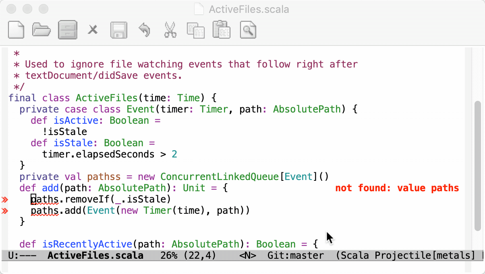

Metals works in Emacs thanks to the the
[`lsp-scala`](https://github.com/rossabaker/lsp-scala) package.



> The Emacs LSP client has [several known issues](#known-issues). Most
> critically, diagnostics are not published for unopened buffers meaning compile
> errors can get lost.

```scala mdoc:requirements

```

## Installation

First, clone the `lsp-scala` repository.

```sh
git clone https://github.com/rossabaker/lsp-scala.git
```

Next, update your Emacs configuration to load `lsp-scala` along with its
dependencies

```el
;; Add melpa-stable to your packages repositories
(add-to-list 'package-archives '("melpa-stable" . "https://stable.melpa.org/packages/") t)

;; Enable defer and ensure by default for use-package
(setq use-package-always-defer t
      use-package-always-ensure t)

;; Enable scala-mode and sbt-mode
(use-package scala-mode
  :mode "\\.s\\(cala\\|bt\\)$")

(use-package sbt-mode
  :commands sbt-start sbt-command
  :config
  ;; WORKAROUND: https://github.com/ensime/emacs-sbt-mode/issues/31
  ;; allows using SPACE when in the minibuffer
  (substitute-key-definition
   'minibuffer-complete-word
   'self-insert-command
   minibuffer-local-completion-map))

;; Enable nice rendering of diagnostics like compile errors.
(use-package flycheck
  :init (global-flycheck-mode))

(use-package lsp-mode
  :pin melpa-stable)

(use-package lsp-ui
  :pin melpa-stable
  :hook (lsp-mode . lsp-ui-mode))

(use-package lsp-scala
  :load-path "~/path/to/lsp-scala"
  :hook (scala-mode . lsp-scala-enable))
```

> You may need to disable other packages like `ensime` or sbt server to prevent
> conflicts with Metals.

If you start Emacs now then it will fail since the `metals-emacs` binary does
not exist yet.

```scala mdoc:bootstrap:metals-emacs emacs

```

The `-Dmetals.client=emacs` flag is important since it configures Metals for
usage with Emacs.

```scala mdoc:editor:emacs

```

## Manually trigger build import

To manually trigger a build import, run `M-x lsp-scala-build-import`.


## Run doctor

Run `M-x lsp-scala-doctor-run` to troubleshoot potential configuration problems
in your build.


## Known issues

- `lsp-mode` blocks the UI during the `initialize` handshake so you may notice
  that opening `*.scala` file gets slower. Metals does as much as possible to
  move computation out of `initialize` but `lsp-mode` should ideally not freeze
  the UI during any LSP request/response cycle.
- `lsp-mode` does not publish diagnostics for unopened buffers so you only see
  compile errors for the open file.
- `lsp-mode` does not send a `shutdown` request and `exit` notification when
  closing Emacs meaning Metals can't properly clean up resources.
- `lsp-mode` does not respect the Metals server capabilities that are declared
  during the initialize handshake. The following warnings can be ignored in the
  logs:
  - `textDocument/hover is not supported`
  - `textDocument/documentSymbol is not supported`
- `lsp-mode` executes `workspace/executeCommand` commands within a specific
  timeout so long-running commands like "Import build" cause the following error
  to be reported in the logs:
  `lsp--send-wait: Timed out while waiting for a response from the language server`.
  Feel free to ignore this error.
- `flycheck` does not explicitly support Windows so diagnostics may not report
  correctly on Windows:
  http://www.flycheck.org/en/latest/user/installation.html#windows-support

### eglot

There is an alternative LSP client called
[eglot](https://github.com/joaotavora/eglot) that might be worth trying out to
see if it addresses the issues of lsp-mode.

To configure Eglot with Metals:

```el
;; Add melpa-stable to your packages repositories
(add-to-list 'package-archives '("melpa-stable" . "https://stable.melpa.org/packages/") t)

;; Enable defer and ensure by default for use-package
(setq use-package-always-defer t
      use-package-always-ensure t)

;; Enable scala-mode and sbt-mode
(use-package scala-mode
  :mode "\\.s\\(cala\\|bt\\)$")

(use-package sbt-mode
  :commands sbt-start sbt-command
  :config
  ;; WORKAROUND: https://github.com/ensime/emacs-sbt-mode/issues/31
  ;; allows using SPACE when in the minibuffer
  (substitute-key-definition
   'minibuffer-complete-word
   'self-insert-command
   minibuffer-local-completion-map))

(use-package eglot
  :pin melpa-stable
  ;; (optional) Automatically start metals for Scala files.
  :config
  (add-to-list 'eglot-server-programs '(scala-mode . ("metals-emacs")))
  :hook (scala-mode . eglot-ensure))
```

```scala mdoc:generic

```
