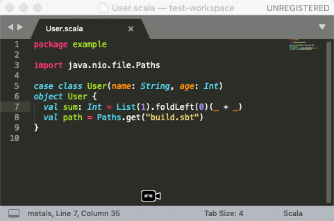
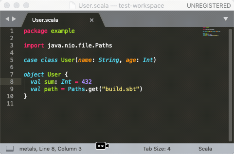
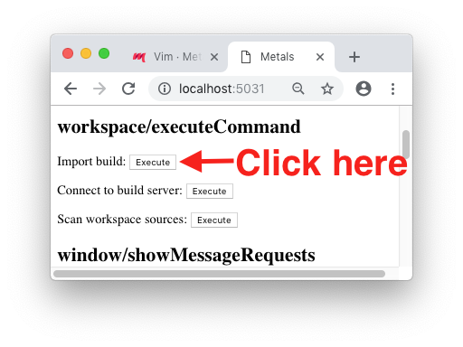

Metals has experimental support for Sublime Text 3 thanks to
[tomv564/LSP](https://github.com/tomv564/LSP).



```scala mdoc:requirements

```

## Installing the plugin

First, install the LSP plugin:
`Command Palette (Cmd + Shift + P) > Install package > LSP`

```scala mdoc:bootstrap:metals-sublime sublime

```

The `-Dmetals.client=sublime` flag configures Metals for usage with the Sublime
Text LSP client.

Next, update the LSP plugin settings to run `metals-sublime` for Scala sources:
`Command Palette (Cmd + Shift + P) > LSP Settings`. Update the JSON file to
include the Metals server.

```json
{
  "clients": {
    "metals": {
      "command": ["metals-sublime"],
      "enabled": true,
      "languageId": "scala",
      "scopes": ["source.scala"],
      "syntaxes": ["Packages/Scala/Scala.sublime-syntax"]
    }
  }
}
```

Next, open "Preferences > Key Binding" and register `F12` to trigger goto
definition.

```json
[
  // ...
  { "keys": ["f12"], "command": "lsp_symbol_definition" }
]
```

## Importing a build

Open Sublime in the base directory of an sbt build. Run the "Enable Language
Server in project" command.



This starts the Metal language server but no functionality will work because the
build has not been imported. It is currently not possible to import the build
inside Sublime Text so you will need to visit
[http://localhost:5031](http://localhost:5031/) in your web browser.



Click on "Import build" to start the `sbt bloopInstall` step. While the
`sbt bloopInstall` step is running, no Metals functionality will work.

This step can take a long time, especially the first time you run it in a new
workspace. The exact time depends on the complexity of the build and if library
dependencies are cached or need to be downloaded. For example, this step can
take everything from 10 seconds in small cached builds up to 10-15 minutes in
large uncached builds.

For more detailed information about what is happening behind the scenes during
`sbt bloopInstall`:

```
tail -f .metals/metals.log
```

Once the import step completes, compilation starts for your open `*.scala`
files. Once the sources have compiled successfully, you can navigate the the
sources with "Goto definition" by pressing `F12`.

## Known issues

- The Sublime Text client does not implement `window/showMessageRequest` making
  it necessary to import the build via the browser instead of inside the editor.
  See [LSP#474](https://github.com/tomv564/LSP/pull/474) for a pending fix.
- The Sublime Text client uses an alert window for `window/showMessage` that
  prevents you from editing code so Metals uses `window/logMessage` instead.

```scala mdoc:generic

```
