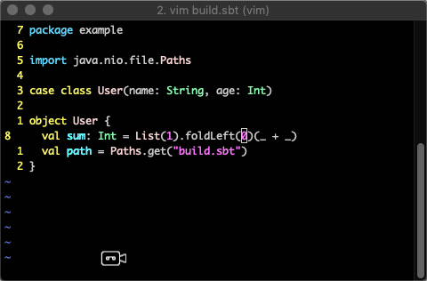
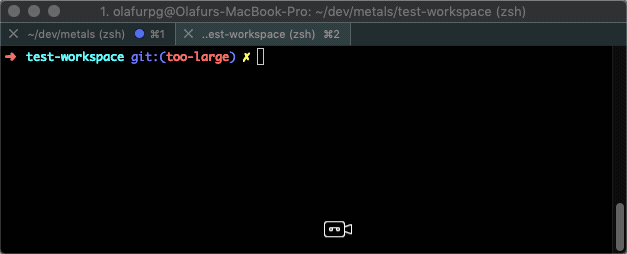
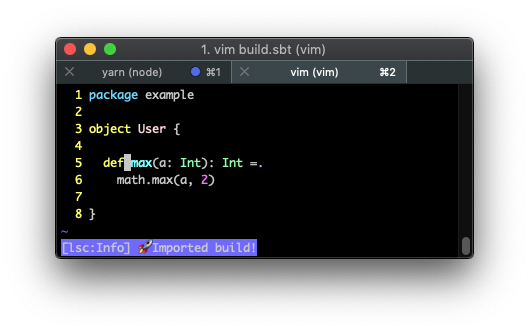

Metals works in vim thanks to the the
[`vim-lsc`](https://github.com/natebosch/vim-lsc/) extension.



```scala mdoc:requirements

```

## Installing the plugin

First, install the following plugins

- [`natebosch/vim-lsc`](https://github.com/natebosch/vim-lsc/): Language Server
  Protocol client to communicate with the Metals language server.
- [`derekqyatt/vim-scala`](https://github.com/derekwyatt/vim-scala): for syntax
  highlighting Scala and sbt source files.

If you use [`vim-plug`](https://github.com/junegunn/vim-plug)

```vim
" ~/.vimrc
Plug 'derekwyatt/vim-scala'
Plug 'natebosch/vim-lsc'
```

Next, build a `metals-vim` binary using the
[Coursier](https://github.com/coursier/coursier) command-line interface.

```sh
coursier bootstrap \
  --java-opt -XX:+UseG1GC \
  --java-opt -XX:+UseStringDeduplication  \
  --java-opt -Xss4m \
  --java-opt -Xms1G \
  --java-opt -Xmx4G  \
  --java-opt -Dmetals.client=vim-lsc \
  org.scalameta:metals_2.12:@VERSION@ \
  -r bintray:scalacenter/releases \
  -o metals-vim -f
```

The `-Dmetals.client=vim-lsc` flag configures Metals for usage with the
`vim-lsc` client.

(optional) Feel free to place this binary anywhere on your `$PATH`, for example
adapt the `-o` flag like this:

```diff
-  -o metals-vim -f
+  -o /usr/local/bin/metals-vim -f
```

Next, update `~/.vimrc` to tell `vim-lsc` to use `metals-vim` for Scala sources
and map `gd` to run "Goto definition".

```vim
" ~/.vimrc

" vim-scala
au BufRead,BufNewFile *.sbt set filetype=scala

" vim-lsc
let g:lsc_enable_autocomplete = v:false
let g:lsc_server_commands = {
  \ 'scala': 'metals-vim'
  \}
let g:lsc_auto_map = {
    \ 'GoToDefinition': 'gd',
    \}
```

## Importing a build

Go to the root directory of an sbt build, open `build.sbt` and navigate to any
`*.scala` source file.

When Metals encounters a new sbt build it will prompt you to "Import build via
Bloop". Select `1` and press enter.



While the `sbt bloopInstall` step is running, no Metals functionality will work.

This step can take a long time, especially the first time you run it in a new
workspace. The exact time depends on the complexity of the build and if library
dependencies are cached or need to be downloaded. For example, this step can
take everything from 10 seconds in small cached builds up to 10-15 minutes in
large uncached builds.

For more detailed information about what is happening behind the scenes during
`sbt bloopInstall`:

```
tail -f .metals/metals.log
```

Once the `sbt bloopInstall` step is completed, you will see "Imported build!"



Once the import step completes, compilation starts for your open `*.scala`
files. Once the sources have compiled successfully, you can navigate the the
sources with "Goto definition" by pressing `gd` in normal mode.

## How to

Some tips on how to effectively use Metals with vim.

### Learn more about vim-lsc

For comprehensive documentation about vim-lsc, run the following command.

```vim
:help lsc
```

### Customize goto definition

Configure `~/.vimrc` to use a different command than `gd` for triggering "goto
definition".

```vim
" ~/.vimrc
let g:lsc_auto_map = {
    \ 'GoToDefinition': 'gd',
    \}
```

### List all workspace compile errors

To list all compilation errors and warnings in the workspace, run the following
command.

```vim
:LSClientAllDiagnostics
```

This is helpful to see compilation errors in different files from your current
open buffer.

### Close buffer without exiting

To close a buffer and return to the previous buffer, run the following command.

```vim
:bd
```

This command is helpful when navigating in library dependency sources in the
`.metals/readonly` directory.

### Shut down the language server

The Metals server is shutdown when you exit vim as usual.

```vim
:wq
```

This step clean ups resources that are used by the server.

### Manually start build import

To manually start the `sbt bloopInstall` step, call the following command below.
This command works only for sbt builds at the moment.

```vim
:call lsc#server#call(&filetype, 'workspace/executeCommand', { 'command': 'build.import' }, function('abs'))
```

The callback `function('abs')` can be replaced with any function that does
nothing.

### Manually connect with build server

To manually tell Metals to establish a connection with the build server, call
the command below. This command works only at the moment if there is a `.bloop/`
directory containing JSON files.

```vim
:call lsc#server#call(&filetype, 'workspace/executeCommand', { 'command': 'build.connect' }, function('abs'))
```

The callback `function('abs')` can be replaced with any function that does
nothing.

## Known issues

- [#113](https://github.com/natebosch/vim-lsc/issues/113) vim-lsc does not send
  an `initialized` notifications following an `initialize` response.
- [#114](https://github.com/natebosch/vim-lsc/issues/114) vim-lsc does not send
  `didSave` notifications. This may cause Goto definition to fail for recently
  edited sources.

## LanguageClient-neovim

The `vim-lsc` client is recommended over the
[`autozimu/LanguageClient-neovim`](https://github.com/autozimu/LanguageClient-neovim/)
client for the following reasons:

- Installation is more complicated compared to vim-lsc
- `LanguageClient-neovim` does not implement `window/showMessageRequest`
- `LanguageClient-neovim` does not implement `window/logMessage`
