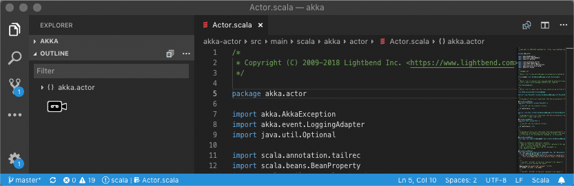
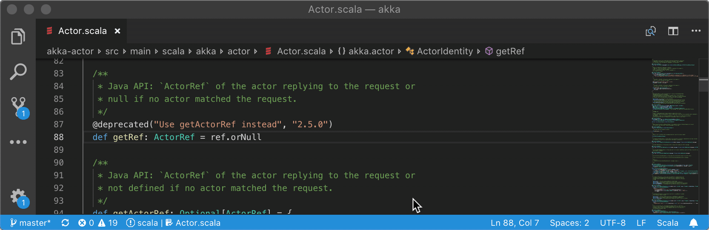
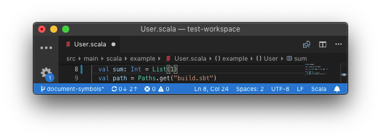

```scala mdoc:requirements

```

## Installation

Install the Metals extension from the Marketplace, search for "Metals".

[](vscode:extension/scalameta.metals)

> Make sure to disable the extensions
> [Scala Language Server](https://marketplace.visualstudio.com/items?itemName=dragos.scala-lsp)
> and
> [Scala (sbt)](https://marketplace.visualstudio.com/items?itemName=lightbend.vscode-sbt-scala)
> if they are installed. The
> [Dotty Language Server](https://marketplace.visualstudio.com/items?itemName=lampepfl.dotty)
> does **not** need to be disabled because the Metals and Dotty extensions don't
> conflict with each other.

Next, open a directory containing a `build.sbt` file. The extension activates
when a `*.scala` or `*.sbt` file is opened.

```scala mdoc:editor:vscode
Update the "Sbt Script" setting to use a custom `sbt` script instead of the
default Metals launcher if you need further customizations like reading environment
variables.


```

```scala mdoc:command-palette:vscode

```

## Configure Java version

The VS Code plugin uses by default the `JAVA_HOME` environment variable (via
[`find-java-home`](https://www.npmjs.com/package/find-java-home)) to locate the
`java` executable. Metals only works with Java 8 so this executable cannot point
to another version such as Java 11.

To override the default Java home location, update the "Java Home" variable to
in the settings menu.


If this setting is defined, the VS Code plugin uses the custom path instead of
the `JAVA_HOME` environment variable.

### macOS

To globally configure `$JAVA_HOME` for all GUI applications, see
[this Stackoverflow answer](https://stackoverflow.com/questions/135688/setting-environment-variables-on-os-x).

If you prefer to manually configure Java home through VS Code, run the following
command to copy the Java 8 home path.

```sh
/usr/libexec/java_home -v 1.8 | pbcopy
```

## Using latest Metals SNAPSHOT

Update the "Server Version" setting to try out the latest pending Metals
features.

```scala mdoc:releases

```

Run the "Reload Window" command after updating the setting for the new version
to take effect.

```scala mdoc:generic

```

## Show document symbols

Run the "Explorer: Focus on Outline View" command to open the symbol outline for
the current file in the sidebar.



Run the "Open Symbol in File" command to search for a symbol in the current file
without opening the sidebar.



As you type, the symbol outline is also visible at the top of the file.

