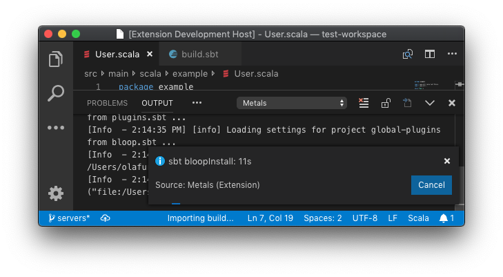

```scala mdoc:requirements

```

## Installation

Install the Metals extension from the Marketplace, search for "Metals".

[Click here to install the Metals VS Code plugin](vscode:extension/scalameta.metals)

Next, open a directory containing a `build.sbt` file. The extension activates
when a `*.scala` or `*.sbt` file is opened.

## Importing a build

The first time you open Metals in a new sbt build it prompts you to "Import
build via Bloop". This step is required for compile errors and goto definition
to work.


Click "Import build via Bloop" to start the `sbt bloopInstall` import step.



While the `sbt bloopInstall` step is running, no Metals functionality works.

This step can take a long time, especially the first time you run it in a new
build. The exact time depends on the complexity of the build and if library
dependencies are cached or need to be downloaded. For example, this step can
take everything from 10 seconds in small cached builds up to 10-15 minutes in
large uncached builds.

Once the import step completes, compilation starts for your open `*.scala`
files. Once the sources have compiled successfully, you can navigate the
codebase with "goto definition" by `Cmd+click` or `F12`.

When you change `build.sbt` or sources under `project/`, you will be prompted to
re-import the build.


Click "Import changes" and that will restart the `sbt bloopInstall` step. Select
"Don't show again" if you prefer to manually trigger build import.

To manually trigger a build import, execute the "Import build" command by
opening the "Command palette" (`Cmd + Shift + P`) and search for "import build".


## Configure Java version

The VS Code plugin uses by default the `JAVA_HOME` environment variable (via
[`find-java-home`](https://www.npmjs.com/package/find-java-home)) to find the
`java` executable. Metals only works with Java 8 so this executable cannot point
to another version such as Java 11.

To override the default Java home location, update the "Java Home" variable to
in the settings menu.


If this setting is defined, the VS Code plugin uses the custom path instead of
the `JAVA_HOME` environment variable.

### macOS

To globally configure `$JAVA_HOME` for all GUI applications, see
[this Stackoverflow answer](https://stackoverflow.com/questions/135688/setting-environment-variables-on-os-x).

If you prefer to manually configure Java home through VS Code, run the following
command to copy the Java 8 home path.

```sh
/usr/libexec/java_home -v 1.8 | pbcopy
```

## Run doctor

Execute the "Run Doctor" from the command palette to troubleshoot potential
configuration problems in your workspace.


