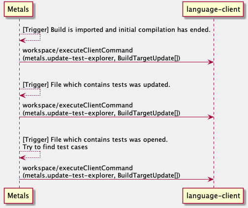
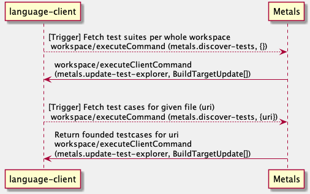

Test Explorer is under active development, this page explain how it works under the hood.

## Test Discovery

Test Explorer (TE) provides two ways to interact with it:

- The first one is based on notifications being sent from Metals to the client and doesn't require the client to do any actions except listen for the notifications. All necessary updates are being immediately sent to it.



- The client can also manually ask Metals for test suites for the whole workspace, or for the test cases for a given file.



## Integration

In order to use TE, the client has to set
`InitializationOptions.testExplorerProvider` and also have the user
configuration setting `test-user-interface` set to `test explorer`. This action
will deactivate code lenses for test classes and enable TE to send updates.

The preferred way to implement TE is to implement client's command `metals-update-test-explorer`. Using this request, Metals will push all necessary updates to the client.

It is also possible to depend on server command `metals.discover-tests`, however this option is discouraged. In the future it may be deprecated and then removed. Currently it exists because VSCode allows users to choose Test UI and this request is used whenever such change in options occurs.

## How it works under the hood

Test Explorer uses BSP's [debug request](https://build-server-protocol.github.io/docs/specification.html#debug-request) to run and debug test classes. TE reuses already available debug support in Metals and build servers such as Bloop or SBT.
Both run and debug under the hood use BSP's debug request.

### Running and debugging

Following diagram ([source](https://github.com/scalacenter/bloop/blob/12bdc7f97cc3970d3e22a8b513f4b609c813f0a7/docs/assets/dap-example-metals.png)) represents what communication between language client, language server and build server. 

The current implementation of TE is a better version of code lenses, with more user friendly UX provided by the VSCode.

### Getting and analyzing results

After test run was finished TE analyzes execution results and sets proper statutes for each test included in run.


Such detailed information is available thanks to the [sbt-test-interface](https://github.com/sbt/test-interface) which abstracts over test framework internals, most important classes are: [Event](https://github.com/sbt/test-interface/blob/17a94641942546e21f4c6b300a3360be2d2888f6/src/main/java/sbt/testing/Event.java) and [Status](https://github.com/sbt/test-interface/blob/17a94641942546e21f4c6b300a3360be2d2888f6/src/main/java/sbt/testing/Status.java) which are used in the [sbt.ForkMain](https://github.com/sbt/sbt/blob/50c3cf10825bae3e89af11b3a2c9741e6d98add5/testing/agent/src/main/java/sbt/ForkMain.java). Almost all of build servers (if not all of them) uses `ForkMain` and `sbt-test-interface` to offload testing.

For each test, there is an [event](https://github.com/sbt/sbt/blob/50c3cf10825bae3e89af11b3a2c9741e6d98add5/testing/agent/src/main/java/sbt/ForkMain.java#L394-L440) fired which contains all necessary information about execution: fully qualified name of test, execution status and duration.
These events are captured by the BSP server (which runs `ForkMain` on the behalf of DAP) and then forwarded to the DAP client as a custom event. Then, those events are captured by the [client](https://github.com/scalameta/metals-vscode/blob/4fb88f8fa6eacb89c6ce9bdc018b3cd7c2bf6f22/src/test-explorer/test-run-handler.ts#L18-L39) and used to determine tests results, after debus session is ended.

An example request forwarded to the client looks like:

```json
{
  "type": "event",
  "seq": 20,
  "event": "testResult",
  "body": {
    "category": "testResult",
    "data": {
      "suiteName": "a.JunitTestSuite",
      "duration": 195,
      "tests": [
        {
          "kind": "failed",
          "testName": "a.JunitTestSuite.test1",
          "duration": 135,
          "error": "* a.JunitTestSuite.test1 - java.lang.AssertionError: assertion failed: should equal be true"
        },
        {
          "kind": "passed",
          "testName": "a.JunitTestSuite.test2",
          "duration": 60
        }
      ]
    },
    "type": "testResult"
  }
}
```
